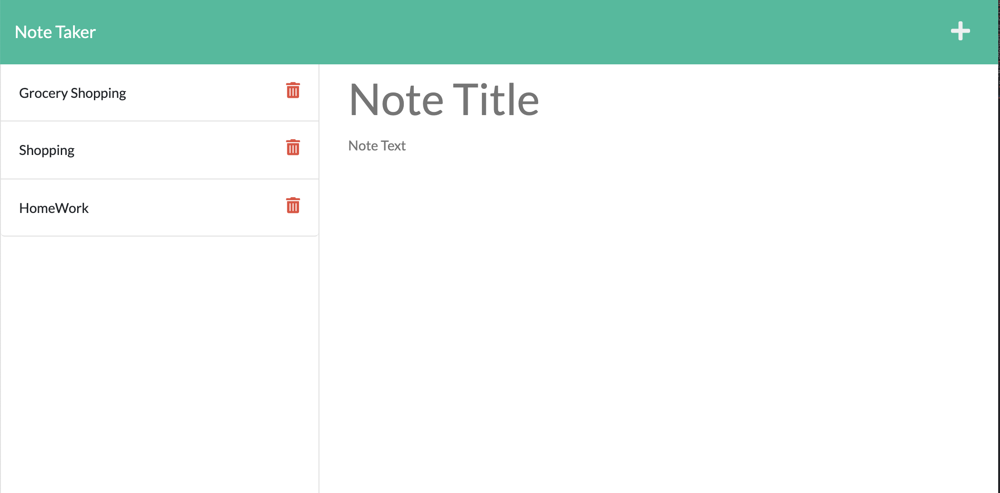
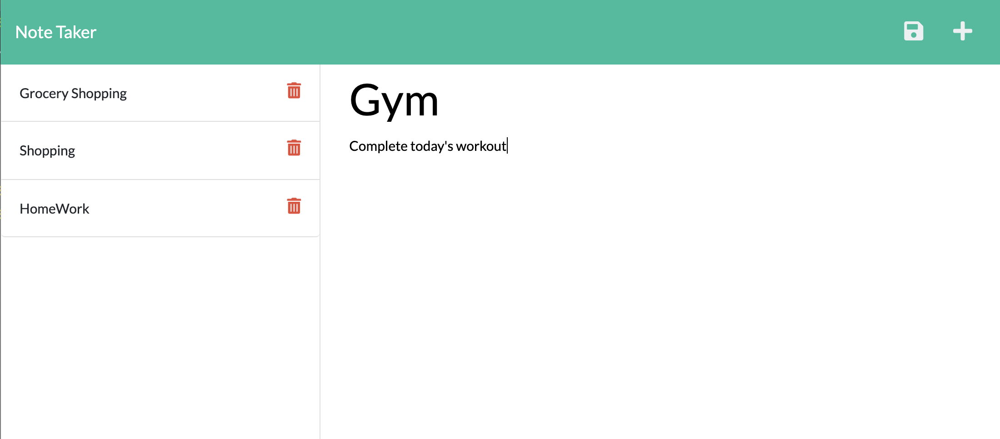
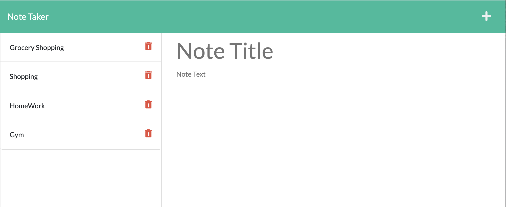

# Note Taker
## Table of Contents 
  - [Description](#description)
  - [Motivation](#motivation)
  - [Usage](#usage)
  - [Problems Solved](#problems-solved)
  - [Tools and Technologies](#tools-and-technologies)
  - [Links](#links)
  - [Sample Video](#sample-video)
  - [Gif](#gif)
  - [Screenshots](#screenshot)
  - [Credits](#credits)

## Description:
Note Taker is an application to write and save note with Express.js back end and will save and retrieve note data from JSON file.

## Motivation
To be able to write and save notes,so that user can organize their thoughts and keep track of tasks to be completed.

## Usage
* Application will allow user to be able to add note's title and description.
* Application will allow user to be able to save the notes and won't lose them even they refresh the page.
* Application will allow user to be delete notes.

## Problems Solved
* When user opens the Note Taker,then they are presented with a landing page with a link to a notes page.
* On clicking the link to the notes page, users are presented with a page with existing notes listed in the left-hand column, plus empty fields to enter a new note title and the note’s text in the right-hand column.
* On entering a new note title and the note’s text, then a Save icon appears in the navigation at the top of the page.
* When user clicks the Save icon, the new note is saved and appears in the left-hand column with the other existing notes.
* On clicking an existing note in the list in the left-hand column, that note appears in the right-hand column.
* When user clicks on the Write icon in the navigation at the top of the page, then they are presented with empty fields to enter a new note title and the note’s text in the right-hand column.

## Tools and Technologies
  * Visual Studio Code
  * GitHub
  * JavaScript
  * Node
  * npm express package
  * uuid package
  * Git
  * Heroku

## Links
* Github: https://github.com/sinka27/Note_Taker
* Heroku: https://note-taker-parul.herokuapp.com

## Sample Video:
The following video demonstrates the application's functionality:
  https://drive.google.com/file/d/1Rf2y7-CsTilcAvLmh71B2sj_5ohJ-z6O/view?usp=sharing

## Gif:

 
## Screenshots:

## Credits
* Parul Raj
* Joe Rehfuss
* Brett Belka
* Louis Coleman